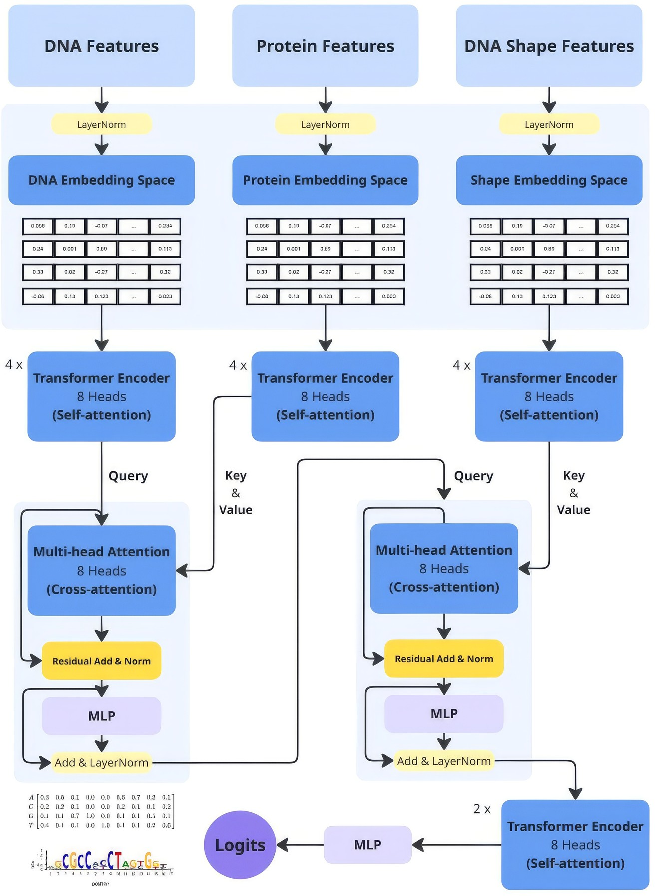

# DeepSpecificity

DeepSpecificity is a structure-aware deep learning framework for predicting the DNA binding specificity of transcription factors directly from protein–DNA complex structures. Given a protein–DNA complex in PDB format, the model predicts a Position Probability Matrix (PPM), which can be converted into a Position Weight Matrix (PWM) for downstream motif analysis and visualization.

The model is designed to learn structural determinants of protein–DNA recognition rather than relying solely on DNA sequence information. It combines protein structural features, DNA backbone geometry, DNA shape descriptors, and protein–DNA interaction features using a transformer-based architecture with cross-attention.

## Features

* Structure-based prediction of transcription factor binding specificity
* Transformer architecture with protein–DNA cross-attention
* Incorporates DNA shape features and relative protein–DNA geometry
* Automatic preprocessing pipeline from PDB structures
* Predicts forward and reverse-complement binding motifs

## Architecture


## Installation

Clone the repository and install the required dependencies.

```bash
git clone https://github.com/harishbabu2007/DeepSpecificity.git
cd DeepSpecificity

pip install -r requirements.txt
or make a conda environment with the given enviroment.yml
```

Some preprocessing utilities depend on external structural biology software (for example, Reduce and 3DNA/DSSR).
this repo already comes with 3DNA in the preprocessing, Reduce can be installed using conda.

## Model Checkpoints

Pretrained model checkpoints are **not** included in the repository.

The latest trained checkpoint can be downloaded from the **Latest Release** section of this repository and placed inside the `checkpoints/` directory before running inference.

## Training data.
The list of PDBS used to train and evaluate this model is available in the ```data availability``` directory

## Running Inference

The repository includes an inference script that performs the complete prediction pipeline starting from a protein–DNA complex.

Example:

```bash
python inference.py \
    --pdb path/to/complex.pdb \
    --checkpoint checkpoints/best_model.pt
```

- refer to ```inference.py``` for more options.
- some sample PDBS are provided for inferencing.

The inference pipeline performs:

1. Structure validation and preprocessing.
2. Protein, DNA, and DNA shape feature extraction.
3. Forward and reverse-complement prediction.
4. Generation of predicted Position Probability Matrices (PPMs).

Predicted motifs is converted to PWMs for visualization using logomaker.

## Repository Overview

* `architecture/` - Transformer model implementation.
* `preprocessing/` - Dataset generation and feature extraction utilities.
* `inference.py` - End-to-end inference pipeline.
* `trainer.py` - Model training script.
* `losses.py` - implemented loss function .
* `utils.py` - Utility functions used throughout the project.

## License

This project is released under the MIT License.
